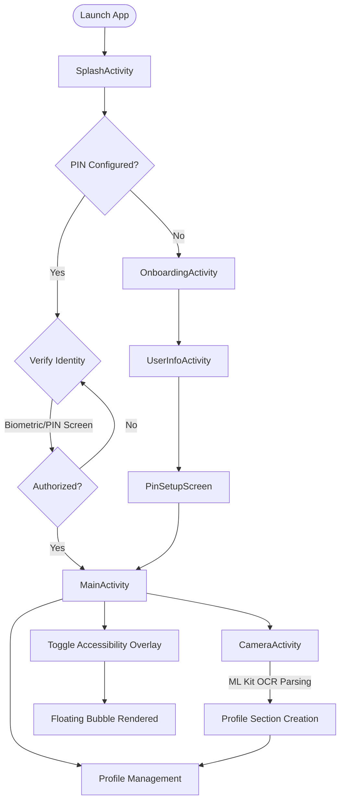
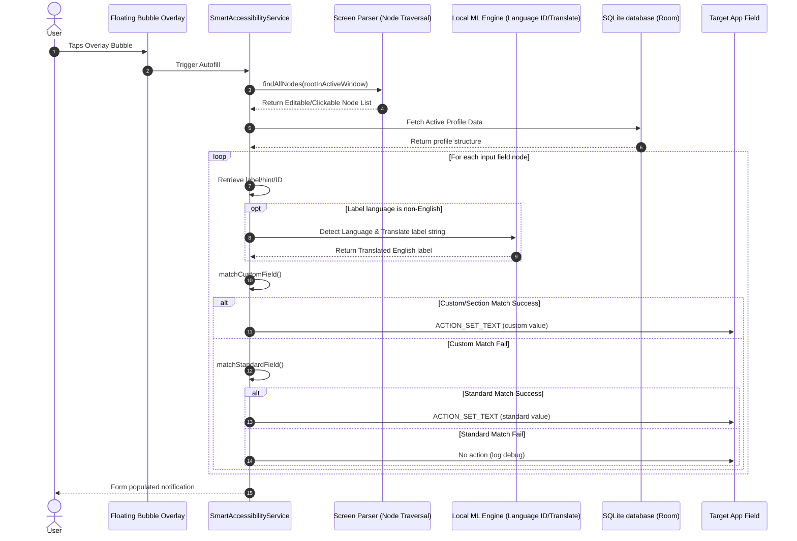
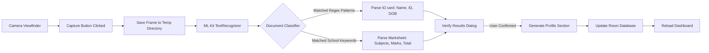
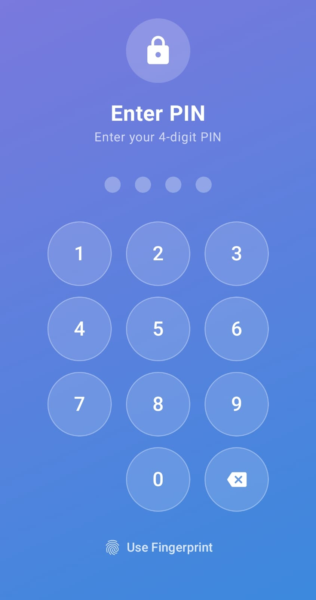
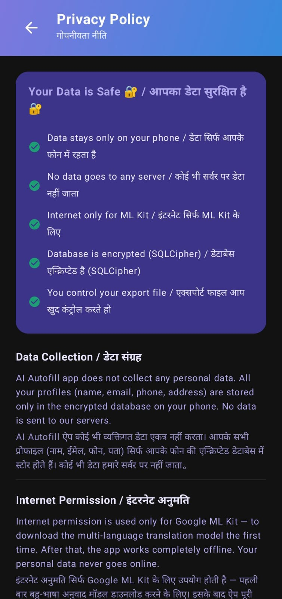
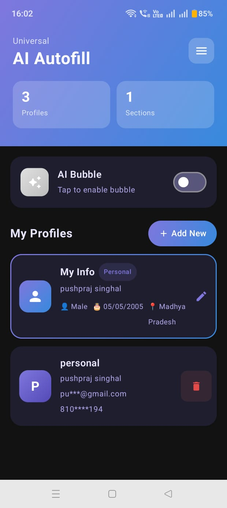
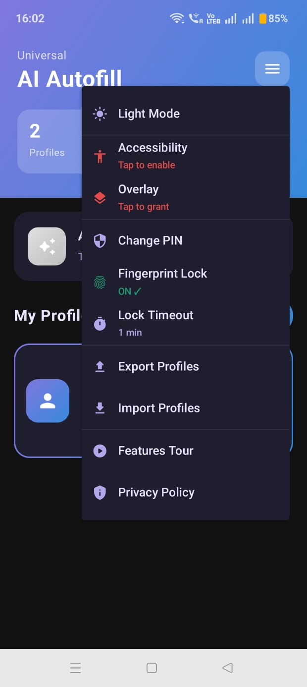
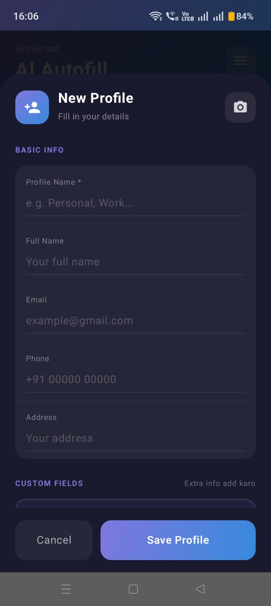
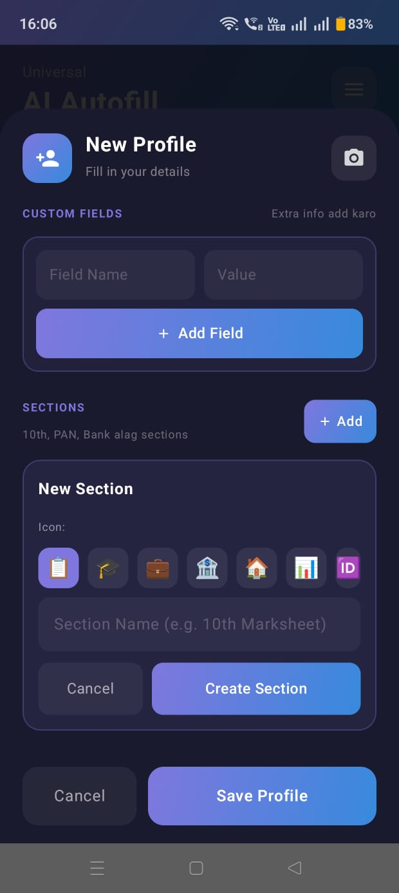
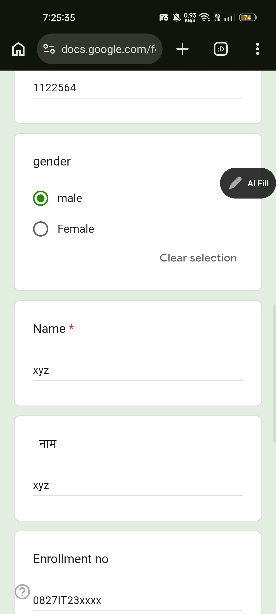

# Universal AI Autofill Assistant

An offline-first, intelligent Android application designed to automate form-filling across any app, browser, or WebView on Android devices using a secure floating overlay and on-device machine learning.

---

## 📖 Introduction
Form filling is a ubiquitous task. Whether registering for academic courses, applying for jobs, registering on portals, or purchasing items on e-commerce sites, users are constantly forced to input identical personal, academic, and professional details. 

**Universal AI Autofill Assistant** eliminates this repetition. By storing personal data locally in structured profiles with custom sections (e.g., identity cards, academic marksheets), the app traverses the active screen's layout hierarchy, matches labels using string metrics and translation heuristics, and populates the forms instantly via a single-tap floating overlay.

---

## ⚠️ Problem Statement
1. **Redundant Data Entry:** Repeated entry of names, emails, registration numbers, addresses, and subject-wise grades across numerous platforms.
2. **Context Fragmentation:** Standard autofill APIs (like Android Autofill or Google Autofill) only work in fields that explicitly declare their content types and are unsupported in many third-party apps, custom web browsers, and hybrid WebViews.
3. **Data Privacy Concerns:** Uploading highly sensitive information (like identification numbers, bank accounts, or grades) to cloud-based autofill extensions exposes users to privacy breaches.
4. **Language Barriers:** Forms are often presented in regional languages, rendering standard English-focused autofill tools ineffective.

---

## 🎯 Objectives
* Develop a **universal form-filling mechanism** that works across *all* applications and WebViews, regardless of third-party platform configuration.
* Keep all sensitive data **100% offline and localized** on the device, ensuring absolute user privacy.
* Leverage **device-side OCR** to scan identity documents and academic marksheets to auto-populate user profiles.
* Implement **offline translation** and language identification to support multi-lingual form matching.
* Maintain a highly **secure sandbox** using encrypted stores, biometric prompts, and lockout mechanisms.

---

## 🌟 Key Features
* **Floating Bubble Interface:** A non-intrusive system overlay allowing users to trigger form-filling or switch active profiles directly from any open form.
* **Smart Hierarchy Parsing:** Accessibility Service-based node traversal that scans field labels, hints, and content descriptions dynamically.
* **Document Scanner (OCR):** CameraX interface integrated with Google ML Kit Text Recognition to scan ID cards (e.g., PAN, Aadhaar, Driver License, Passport) and academic marksheets to automatically construct profile sections.
* **Multi-Language Support:** Local Language ID and Translation models that translate regional field labels to English in real-time, allowing English profiles to fill regional language forms.
* **Dropdown Option Matching:** Automates matching and selection of radio buttons, checkboxes, and standard spinner dropdown lists (e.g. Gender, State, Country, DOB spinners).
* **WebView Form Filling:** Traverses and populates inputs loaded inside hybrid WebViews, in-app browsers, and standard Chrome contexts.
* **Text Expansion Shortcuts:** Custom abbreviations (e.g., typing `name-` or `email-` in a field followed by a bubble tap) to perform instant inline text expansions.
* **Quick Copy Panel:** Foreground notification service (`QuickCopyService`) displaying quick buttons to copy Name, Email, and Phone data directly from the system tray.
* **Local Backups:** Complete JSON profile import and export utility for seamless data transfers between devices.
* **Robust Security Sandbox:** AES-256 protected credentials via `EncryptedSharedPreferences`, biometrics validation (`BiometricPrompt`), local root-detection checks, and automatic 30-second clipboard clearing.

---

## 🛠️ Technology Stack
* **Language:** Kotlin
* **UI Framework:** Jetpack Compose (Declarative UI) and standard Android XML Layouts (for overlay Windows)
* **Architecture:** MVVM (Model-View-ViewModel) + StateFlow
* **Database:** SQLite managed via Room Persistence Library
* **ML Engines:** Google ML Kit (Text Recognition, Language ID, Translation)
* **API Targets:** Compile/Target SDK 36, Min SDK 26 (Android 8.0+)
* **Device APIs:** CameraX, Android Accessibility Service Framework, Android Autofill Framework, Biometric API

---

## 🏗️ Architecture Overview

The system operates strictly on-device, split into clean layers:

```
┌────────────────────────────────────────────────────────────────────────┐
│                              USER INTERFACE                            │
│   ┌──────────────────────┐  ┌────────────────────┐  ┌──────────────┐   │
│   │ MainActivity (Compose)│  │ Floating Bubble View│  │ Camera (Scan)│   │
│   └──────────┬───────────┘  └─────────┬──────────┘  └──────┬───────┘   │
└──────────────┼────────────────────────┼────────────────────┼───────────┘
               ▼                        ▼                    ▼
┌────────────────────────────────────────────────────────────────────────┐
│                        BUSINESS LOGIC / SERVICES                       │
│  ┌───────────────────────┐  ┌───────────────────────────────────────┐  │
│  │   ProfileViewModel    │  │       SmartAccessibilityService       │  │
│  └───────────┬───────────┘  └─────────┬───────────────────┬─────────┘  │
└──────────────┼────────────────────────┼───────────────────┼───────────┘
               ▼                        ▼                   ▼
┌───────────────────────────┐ ┌───────────────────┐ ┌────────────────────┐
│      LOCAL DATABASE       │ │  SECURITY ENGINE  │ │   OFFLINE ML KIT   │
│ ┌───────────────────────┐ │ │ ┌───────────────┐ │ │ ┌────────────────┐ │
│ │  Room DB (SQLite)     │ │ │ │ PinManager    │ │ │ │ OCR & Translate│ │
│ │  Profiles & Custom    │ │ │ │ Biometrics    │ │ │ │ Language ID   │ │
│ │  Sections (JSON)      │ │ │ └───────────────┘ │ │ └────────────────┘ │
│ └───────────────────────┘ │ └───────────────────┘ └────────────────────┘
└───────────────────────────┘
```

---

## 📊 System Architecture Diagrams

These flowcharts outline the application's runtime cycles and parsing engines (located in [System Architecture Docs](file:///docs/System_Architecture.md)):


*Figure 1: Global Application Security & Verification Lifecycle*


*Figure 2: Smart Accessibility Service Traversal and Matching Pipeline*


*Figure 3: CameraX Frame Capture and ML Kit Document Parsing Pipeline*

---

## 📁 Repository Structure
```
universal-ai-autofill-assistant/
├── .github/                  # PR templates and issue configurations
│   └── PULL_REQUEST_TEMPLATE.md
├── backend/                  # Services, security engines, and background tasks
│   ├── AiFillTileService.kt
│   ├── AppDatabase.kt
│   ├── Converters.kt
│   ├── CopyReceiver.kt
│   ├── PinManager.kt
│   ├── QuickCopyService.kt
│   ├── SmartAccessibilityService.kt
│   ├── SmartAutofillService.kt
│   ├── UserProfile.kt
│   └── UserProfileDao.kt
├── core/                     # Application lifecycle, main screens, database setup, and configurations
│   ├── AppDatabase.kt
│   ├── Converters.kt
│   ├── MainActivity.kt
│   ├── ProfileViewModel.kt
│   ├── UserProfile.kt
│   ├── UserProfileDao.kt
│   ├── build.gradle.kts
│   ├── gradle.properties
│   └── settings.gradle.kts
├── frontend/                 # UI layouts, colors, theme typography, and Compose Activities
│   ├── CameraActivity.kt
│   ├── Color.kt
│   ├── FeaturesActivity.kt
│   ├── OnboardingActivity.kt
│   ├── PrivacyPolicyActivity.kt
│   ├── SplashActivity.kt
│   ├── Theme.kt
│   ├── Type.kt
│   ├── UserInfoActivity.kt
│   ├── autofill_item.xml
│   ├── layout_floating_bubble.xml
│   ├── layout_profile_item.xml
│   └── layout_profile_selector.xml
├── database/                 # SQL schemas and sample import profiles
├── docs/                     # User, technical, and architectural docs
├── screenshots/              # UI screens & demonstrations
├── team/                     # Contributions, commit plans, and workflows
└── tests/                    # Detailed QA test case matrix
```
*For a detailed walkthrough of directory contents, see [System Architecture](file:///docs/System_Architecture.md).*

---

## 🚀 Installation & Setup

### 📲 Quick Sideload Installation (For Mobile Evaluators)
Installing and running the app takes less than 2 minutes directly on your phone:
1. **Download the APK:** Copy the compiled release file onto your Android device: **[app-release.apk](file:///c:/Users/talre/OneDrive/Documents/new/universal-ai-autofill-assistant/app/release/app-release.apk)**.
2. **Install:** Tap the APK file to install it. If prompted with a "Blocked by Play Protect" or "Unknown Source" warning, click **"Install Anyway"**.
3. **Configure PIN:** Open the app, follow the onboarding screens, and define a secure **4-digit PIN** to protect your profile details.
4. **Grant Permissions:** Enable **Display Over Other Apps (Overlay)** and toggle **AI Autofill** to **ON** inside **Settings ➔ Accessibility ➔ Installed Apps**.

### 💻 Developer Setup (Build from Source)
1. Open Android Studio (Hedgehog 2023.1.1 or newer recommended) with compileSdk 36.
2. Choose **File ➔ Open**, pointing to the cloned root directory of this repository.
3. Gradle will synchronize automatically.
4. Create a `.env` configuration file from the [Template](file:///.env.example) in the root.
5. Connect your device via USB (verify **USB Debugging** is toggled ON).
6. Click the green **Run** icon (or press **Shift + F10**) to build and deploy.

---

## 🗄️ Database Design
The application uses local storage to ensure user data remains private.

* **Room Database (`AppDatabase`, Version 5):**
  * Maintains a single table `UserProfile`.
  * Complex structural mappings (such as `customFields` Maps and lists of structured `ProfileSections`) are serialized into JSON strings via `CustomFieldsConverter` and saved directly in SQLite text columns.
  
*For schema details, SQL declarations, and mock JSON profile imports, view the [Database Documentation](file:///database/README.md).*

---

## 📸 Screenshots & UI Flow

Below are the actual screenshots captured from the application interfaces:

### 🚀 Onboarding & Info Setup Flow
<p align="center">
  
  
  
  
</p>

### 🗂️ Profiles Pinned Dashboard & Custom Editing
<p align="center">
  
  
</p>

### 💬 Floating Overlay Bubble & Autofill Action
<p align="center">
  
  
</p>

---

## 🧪 Testing Summary
The QA process comprises:
* **Unit Verification:** Validates matching algorithms, translation buffers, configuration parsing, and PIN lockout sequences (located in [Test Cases](file:///tests/Test_Cases.md)).
* **UI Testing:** Jetpack Compose UI layout tests verifying dialog actions, menu toggles, and edit fields.
* **On-Device Diagnostics:** Running Accessibility tree captures to evaluate performance and memory footprints during continuous page traversal.

*Review complete validation scenarios in [Test Cases Matrix](file:///tests/Test_Cases.md) and metrics in [Test Results](file:///tests/Test_Results.md).*

---

## 👥 Team & Responsibilities
This is a 4-member academic team project:

# 👥 Division of Responsibilities

## Pushpraj Singhal (Core Engineer & System Integration)
- Managed app architecture (MVVM) and navigation.
- Developed Room Database, data models, and JSON converters.
- Handled Gradle build configuration and project setup.

## Vinay (Frontend & UI/UX)
- Designed onboarding and splash screens with animations.
- Developed app themes, colors, and typography.
- Created floating bubble, profile selector, and profile list UI layouts.

## Samyak (Camera, Profile & ML Integration)
- Built document scanning with Google ML Kit OCR.
- Developed profile creation and management screens.
- Implemented Privacy Policy and autofill-related UI components.

## Devesh (Backend Services, Security & QA)
- Developed autofill, text expansion, and accessibility services.
- Built authentication, Quick Settings tile, and clipboard services.
- Integrated security features and conducted Android 14–16 testing.


---

## 🔮 Future Enhancements
* **OTP Auto-Detection & Autofill:** Listen to incoming SMS notifications to detect verification codes via SMS Retriever APIs and automatically populate input boxes.
* **Cloud Sync Integration:** Optional, end-to-end encrypted backup systems to sync profiles with cloud lockers (e.g. Google Drive) securely.
* **On-Device ML Form Classifier:** Use TensorFlow Lite or custom local weights to predict field matching types based on layout coordinate vectors.
* **Browser Sync Extension:** Synchronize stored credentials locally with desktop browser overlays over a local Wi-Fi connection.

---

## 📚 References & Resources
1. Android Developers Guide: [Accessibility Service API](https://developer.android.com/guide/topics/ui/accessibility/service)
2. Jetpack Compose UI documentation: [Compose UI Layouts](https://developer.android.com/compose)
3. Google Developers: [ML Kit Text Recognition Guide](https://developers.google.com/ml-kit/vision/text-recognition)
4. Android Security: [Cryptography and EncryptedSharedPreferences](https://developer.android.com/topic/security/data)
