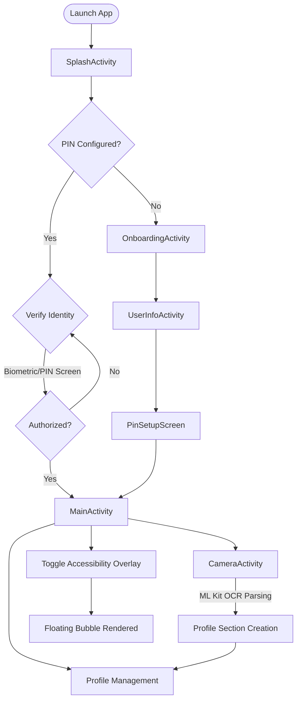
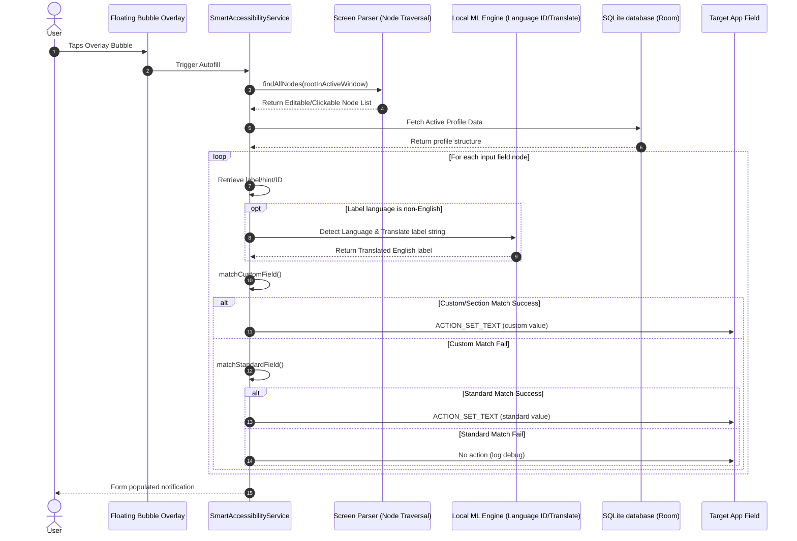
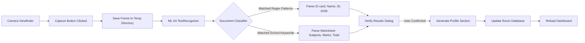

# System Architecture

This document maps out the system architecture and runtime flows of the **Universal AI Autofill Assistant** using visual diagrams.

---

## 🗺️ 1. Global Application Lifecycle

This flowchart shows the navigation pathways, security checks, and activity states of a user session.

---

## ⚡ 2. Smart Form-Filling Pipeline

This flow diagram illustrates how the `SmartAccessibilityService` reacts to a user tapping the floating bubble overlay, parses the screen, matches labels, and injects text values.

---

## 📷 3. Camera Capture & OCR Pipeline

This flowchart shows how the physical document scanning feature captures images, executes OCR processing offline, and updates the local profile.

